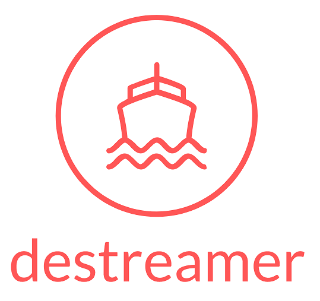
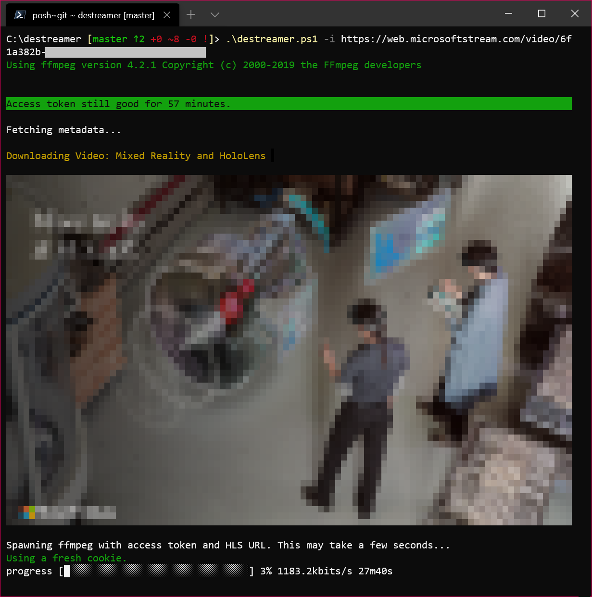

<a href="https://github.com/snobu/destreamer/actions">
  
</a>



_(Alternative artwork proposals are welcome! Submit one through an Issue.)_

# Saves Microsoft Stream videos for offline enjoyment

### v2.0 Release, codename _Hammer of Dawn<sup>TM</sup>_

This release would not have been possible without the code and time contributed by two distinguished developers: [@lukaarma](https://github.com/lukaarma) and [@kylon](https://github.com/kylon). Thank you!

## What's new

- Major code refactoring
- Dramatically improved error handling
- We now have a token cache so we can reuse access tokens. This really means that within one hour you need to perform the interactive browser login only once.
- We removed the dependency on `youtube-dl`.
- Getting to the HLS URL is dramatically more reliable as we dropped parsing the DOM for the video element in favor of calling the Microsoft Stream API
- Fixed access token lifetime bugs (you no longer get a 403 Forbidden midway though your download list). Still one outstanding edge case here, see _Found a bug_ at the bottom for more.
- Fixed a major 2FA bug that would sometimes cause a timeout in our code
- Fixed a wide variety of other bugs, maybe introduced a few new ones :)

## Disclaimer

Hopefully this doesn't break the end user agreement for Microsoft Stream. Since we're simply saving the HLS stream to disk as if we were a browser, this does not abuse the streaming endpoints. However i take no responsibility if either Microsoft or your Office 365 admins request a chat with you in a small white room.

## Prereqs

- **Node.js**: You'll need Node.js v10 or higher. A GitHub Action runs tests on all major Node versions on every commit.
- **npm**: usually comes with Node.js, type `npm` in your terminal to check for its presence
- **ffmpeg**: a recent version (year 2019 or above), in `$PATH` or in the same directory as this README file (project root).
- **git**: one or more npm dependencies require git. Install git with your favorite package manager or https://git-scm.com/downloads

Destreamer takes a [honeybadger](https://www.youtube.com/watch?v=4r7wHMg5Yjg) approach towards the OS it's running on. We've successfully tested it on Windows, macOS and Linux.

## How to build

To build destreamer clone this repository, install dependencies and run the build script -

```sh
$ git clone https://github.com/snobu/destreamer
$ cd destreamer
$ npm install
$ npm run build
```

## Usage

```
$ ./destreamer.sh

Options:
  --help                   Show help                                   [boolean]
  --version                Show version number                         [boolean]
  --videoUrls, -i          List of video urls                            [array]
  --videoUrlsFile, -f      Path to txt file containing the urls         [string]
  --username, -u                                                        [string]
  --outputDirectory, -o    The directory where destreamer will save your
                           downloads [default: videos]                  [string]
  --outputDirectories, -O  Path to a txt file containing one output directory
                           per video                                    [string]
  --noExperiments, -x      Do not attempt to render video thumbnails in the
                           console                    [boolean] [default: false]
  --simulate, -s           Disable video download and print metadata information
                           to the console             [boolean] [default: false]
  --verbose, -v            Print additional information to the console (use this
                           before opening an issue on GitHub)
                                                      [boolean] [default: false]
```

Make sure you use the right script (`.sh`, `.ps1` or `.cmd`) and escape char (if using line breaks) for your shell.
PowerShell uses a backtick [ **`** ] and cmd.exe uses a caret [ **^** ].

Note that destreamer won't run in an elevated (Administrator/root) shell.

Download a video -
```sh
$ ./destreamer.sh -i "https://web.microsoftstream.com/video/VIDEO-1"
```

Download a video and speed up the interactive login by automagically filling in the username -
```sh
$ ./destreamer.sh -u user@example.com -i "https://web.microsoftstream.com/video/VIDEO-1"
```

Download a video to a custom path -
```sh
$ ./destreamer.sh -i "https://web.microsoftstream.com/video/VIDEO-1" -o /Users/hacker/Downloads
```

Download two or more videos -
```sh
$ ./destreamer.sh -i "https://web.microsoftstream.com/video/VIDEO-1" \
                     "https://web.microsoftstream.com/video/VIDEO-2"
```

Download many videos but read URLs from a file -
```sh
$ ./destreame.sh -f list.txt
```

You can create a `.txt` file containing your video URLs, one video per line. The text file can have any name, followed by the `.txt` extension.

Passing `--username` is optional. It's there to make logging in faster (the username field will be populated automatically on the login form).

You can use an absolute path for `-o` (output directory), for example `/mnt/videos`.

## Expected output



By default, downloads are saved under `videos/` unless specified by `-o` (output directory).

## Contributing

Contributions are welcome. Open an issue first before sending in a pull request. All pull requests require at least one code review before they are merged to master.

## Found a bug?

There is one outstanding bug that you may hit: if you download two or more videos in one go, if one of the videos take more than one hour to complete, the next download will fail as the cookie is now expired. We'll patch this soon.

For other bugs, please open an [issue](https://github.com/snobu/destreamer/issues) and we'll look into it.